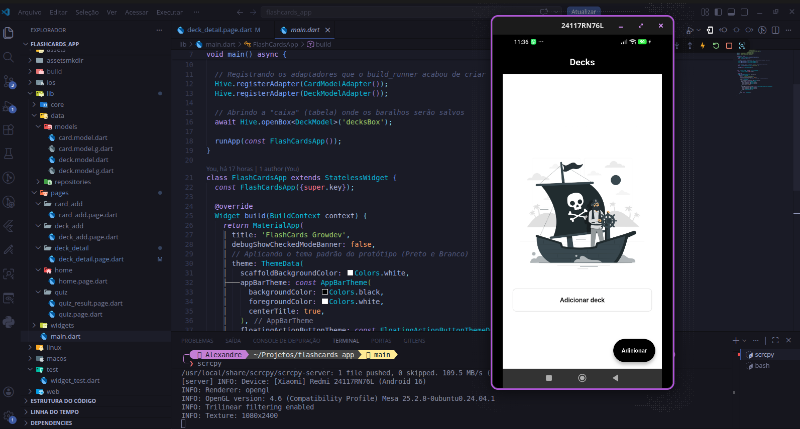

# 🗂️ Flashcards App (Flutter)

Aplicativo mobile desenvolvido em Flutter como desafio da Fase 4 do curso de formação Flutter da Growdev. O projeto consiste em um sistema de memorização estilo "Anki", permitindo a criação de baralhos personalizados e a prática de estudos através de um quiz interativo com armazenamento local.

## 📱 Funcionalidades

- 📦 **Gestão de Baralhos**: Criação de novos baralhos e exclusão (via clique longo na tela inicial).
- 📝 **Gestão de Cartões**: Adição de perguntas e respostas em cada baralho e opção de excluir cartões individualmente.
- 🎮 **Modo Quiz**: Fluxo completo de estudo com visualização de resposta, contabilização de acertos/erros e tela de resultado final.
- 💾 **Persistência Offline**: Utilização do banco de dados NoSQL Hive para manter os dados salvos mesmo após fechar o app.
- 🧩 **Estado Reativo**: Gerenciamento de estado eficiente para atualizações em tempo real.

## ⚙️ Tecnologias utilizadas

- Flutter
- Dart
- Hive & Hive Flutter (banco de dados local)
- MobX & Flutter MobX (gerenciamento de estado)
- Build Runner (geração de código)

## 📸 Demonstração



## ▶️ Como executar o projeto

```bash
# Clone o repositório
git clone [https://github.com/aleehblackstar/flashcards_app.git](https://github.com/aleehblackstar/flashcards_app.git)

# Acesse a pasta
cd flashcards_app

# Instale as dependências
flutter pub get

# Gere os arquivos do Hive e adaptadores
dart run build_runner build --delete-conflicting-outputs

# Execute o projeto
flutter run